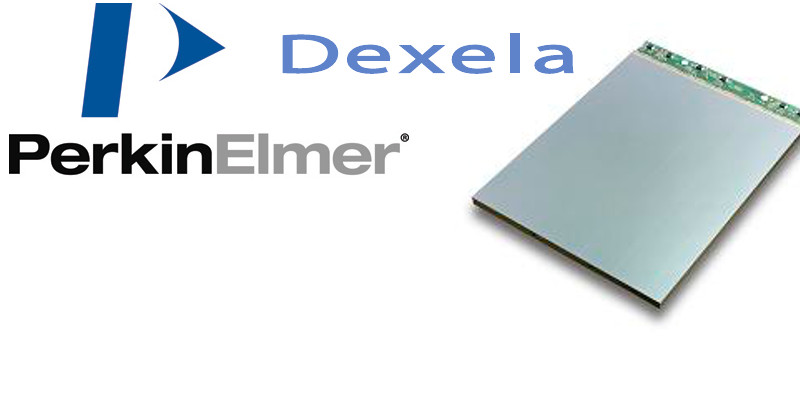

.. _camera-dexela:

Dexela camera plugin
####################

Introduction
************

The Dexela detector is a brand product of  PerkinElmer. PerkinElmer has recently Acquired Dexela Limited a
manufacturer of CMOS flat panel. Nevertheless the Dexela detector SDK still remains not compatible with the other PerkinElmer
detector SDK (see perkinelemer plugin) and one need to use this camera plugin instead.

Prerequisite
************

The Dexela detector model sensor2923 only has been tested at ESRF.

The detector is controlled via an acquisition board: PIXCI(R) E4 PCIExpress Camera Link board (EPIX,Inc.).

You need to install the acquisition card SDK. It was tested with 3.8 version (xclib). You can find them at http://www.epixinc.com/support/files.php .

You also need to install libdexela which is not yet GPL. See detail with mihael.koep@softwareschneiderei.de.

BIOS configuration
==================

You should disable all power saving mode like CSTATE and disable also multiple-threading feature of cpu.

At ESRF, SuperMicro computers have to be configured like this:

 - Simultaneous Multi-threading has to be disabled
 - C1E support has to be disabled
 - Intel CSTATE Tech has to be disabled

Linux kernel configuration
==========================

As the PIXCI acquisition card needs a low jitters configuration, you need to change some kernel parameters.
To do so, you have to change in grub configuration file (under ``/etc/default/grub for debian``) the ``GRUB_CMDLINE_LINUX_DEFAULT``
by adding theses options:

.. code-block:: sh

 pcie_aspm=off
 intel_idle.max_cstate=0
 processor.max_cstate=0
 idle=poll
 mce=ignore_ce
 ipmi_si.force_kipmi=0
 nmi_watchdog=0
 noht
 nosoftlockup
 isolcpus=0

the whole line should look something like this:

.. code-block:: sh

  GRUB_CMDLINE_LINUX_DEFAULT="ipv6.disable=1 quiet pcie_aspm=off intel_idle.max_cstate=0 processor.max_cstate=0 idle=poll mce=ignore_ce ipmi_si.force_kipmi=0 nmi_watchdog=0 noht nosoftlockup isolcpus=0"

You also have to uninstall or disable the irqbalance process.
On Debian you can simply type:

.. code-block:: sh

  sudo apt-get purge irqbalance

Installation & Module configuration
***********************************

Follow the generic instructions in :ref:`build_installation`. If using CMake directly, add the following flag:

.. code-block:: sh

 -DLIMACAMERA_DEXELA=true

For the Tango server installation, refers to :ref:`tango_installation`.

Initialization and Capabilities
*******************************

Implementing a new plugin for new detector is driven by the LIMA framework but the developer has some freedoms to choose which standard and specific features will be made available. This section is supposed to give you the correct information regarding how the camera is exported within the LIMA framework.

Camera initialization
*********************

The camera will be initialized within the :cpp:class:`DexelaInterface`  object.
The parameter to pass to :cpp:func:`DexelaInterface()` constructor is the fill path need for the acquisition card.
This file is generated by xcap software provided by PIXCI. you can find some example in the config directory.

Std capabilities
================

This plugin has been implemented in respect of the mandatory capabilites but with limitations according
due to the detector specific features and with some programmer's  choices.  We do not explain here the standard Lima capabilites
but you can find in this section the useful information on the Dexela specfic features.

* HwDetInfo

 The Dexela detector as a pixel size of 74.8e-6 m (74.8 um) and the image data type is fixed to 16bpp (bit per pixel).

* HwSync

 The supported trigger modes are IntTrig, IntTrigMult, ExtTrigMult and ExtGate.

The exposure time range is 0.0116 (1/86) to 120 seconds.

The latency time is not manage.

Optional capabilities
======================
In addition to the standard capabilities, we make the choice to implement some optional capabilities in order to
have an improved simulation.

* HwShutter

 There is no shutter capability.

* HwRoi

 There is no hardware capability, but Lima provides the sofware Roi as well.

* HwBin

 The supported hardware binning factors are 1x1, 2x2, and 4x4.

How to use
***********
The LimaCCDs tango server provides a complete interface to the dexela plugin so feel free to test.

For a quick test one can use python, is this a short code example:

.. code-block:: python

  from Lima import Dexela
  from lima import Core
  import time

  hwint = Dexela.Interface('./sensor2923.fmt')
  ct = Core.CtControl(hwint)

  acq = ct.acquisition()

  # setting new file parameters and autosaving mode
  saving=ct.saving()

  pars=saving.getParameters()
  pars.directory='/tmp/'
  pars.prefix='testdexela_'
  pars.suffix='.edf'
  pars.fileFormat=Core.CtSaving.EDF
  pars.savingMode=Core.CtSaving.AutoFrame
  saving.setParameters(pars)

  # now ask for 2 sec. exposure and 10 frames
  acq.setAcqExpoTime(2)
  acq.setNbImages(10)

  ct.prepareAcq()
  ct.startAcq()

  # wait for last image (#9) ready
  lastimg = ct.getStatus().ImageCounters.LastImageReady
  while lastimg !=9:
    time.sleep(1)
    lastimg = ct.getStatus().ImageCounters.LastImageReady

  # read the first image
  im0 = ct.ReadImage(0)
